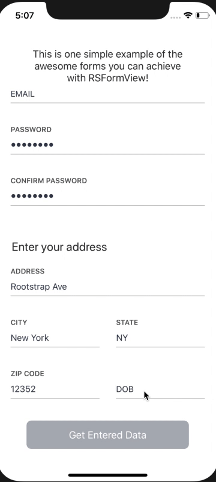

[](https://travis-ci.org/rootstrap/RSFormView)
[](https://codeclimate.com/repos/5cd33d2d08760b668c0049c7/maintainability)
[](https://codeclimate.com/github/rootstrap/RSFormView/test_coverage)
[](https://github.com/rootstrap/RSFormView/blob/master/LICENSE)

# RSFormView


## What is it?

RSFormView is a library that helps you build fully customizable forms for data entry in a few minutes. 



## Installation

RSFormView is available through [CocoaPods](http://cocoapods.org). To install it, simply add the following line to your Podfile:

```ruby
pod "RSFormView"
```
## Usage

1. Add a FormView to your view controller, you can do this either programatically or via Storyboards.


Programatically: 
```swift
let formView = FormView(frame: frame)
view.addSubview(formView)
```
Storyboards:
Add a `UIView` to your view controller and change the class name to `FormView`.

2. Set your view controller as FormViewDelegate:
```swift
class YourViewController: FormViewDelegate { ... }
```
and implement
```swift
func didUpdateFields(allFieldsValid: Bool)
```
This function will be called any time a user enters any data in the form, so it's a great place to update other views dependent on the entered data.

3. Set your view controller as the FormView delegate
```swift
formView.delegate = self
```

4. Set a FormViewModel to your formView


A `FormViewModel` can be any class that implements the `FormViewModel` delegate. 
For a class to implement `FormViewModel` delegate  you only need to define an array of `FormItem`.
Each `FormItem` will determine the behavior and validation of each text field in your form. 
`FormItem` can be a text field, two text fields in line or a "section header"
More about fields configuration in the `FormItem` section.

5. Configure your form looks


Create a `FormConfigurator` change any colors or fonts you need and set it to your form view
```swift
let configurator = FormConfigurator()
configurator.textColor = UIColor.lightGray
configurator.validTitleColor = UIColor.blue
configurator.titleFont = UIFont.systemFont(withSize: 13)
...
formView.formConfigurator = configurator
```
6. Collect data


Any text entry made in your form will be collected in your `FormViewModel`  `items`. 
Since you may have more than one text field per item a better way for collecting your data is making use of the `fields()` function of the `FormViewModel`, like this:
```swift
var user = User()
formViewModel.fields().forEach {
  switch $0.name {
  case "First Name":
    user.firstName = $0.value
  case "Birthdate":
    user.birthdate = $0.value
  default:
    print("\($0.name): \($0.value)")
  }
}
```

## FieldType

`fieldType` is a FormField property that determines the behaviour of the represented TextField.

Cases: 
 - email: Will present the email keyboard when the field is selected and validate that the text entry is in an email format
 - date: Will present a native date picker when the field is selected and validate that the entry is not empty
 - numeric: Will present the numeric keyboard when the field is selected and validate that the text entry can be casted to Int
 - password: Will mask the text entry in UI and validate that the text entry is not empty
 - usPhone: Will decorate the text entry with slashes (111-111-1111) and validate that the text entry is in a valid US phone number format  
 
 Check `FieldType` definition for more supported cases. 
 
 ## ValidationType 
 
 `validationType` is a `FormField` property that determines the validation behaviour of the represented TextField.
 Different `FieldType`s provide different default validations but the validation can be overriden by setting a `ValidationType` to the `FormField`.
 
 Cases: 
 - nonEmpty: Will mark the field invalid if the text entry is empty
 - none: No validation will be made, the field will never be marked invalid unless manually made so
 - numeric: Will mark the field invalid if the text entry is not a number
 - usState: Will validate that the text entry matches the name or abbreviation of any of the US states
 - custom: Pass this case a block with your custom validation.

Custom example: 
```swift
yourFormField.validationType = .custom(evaluator: { [weak self] updatedValue in
  let otherFormField = self?.fields().first { $0.name == "OtherFormFieldName" }
  let otherFormFieldValue = otherFormField?.value ?? ""
  return updatedValue.count > 5 && updatedValue == otherFormFieldValue
})
//In this example the field will be marked valid if the text entry has mora characters than 5 and its text entry is the same as the field with identifier "OtherTextFieldName"  
```

## FormItem

A `FormItem` defines the behaviour of a row, it can be a single text field, two text fields in a row or a simple text row: for example to define a section title.

1. One Text Field item: 

```swift
let birthdateField = FormField(name: "Birthdate field", // the identifier of the field, use this to collect the data later
                               initialValue: "", // the inital value of the field, if its in a date formate it will auto select that date in the picker
                               placeholder: FieldName.birthdate.rawValue, // The placeholder when there's no value and text field title when there is
                               fieldType: .date, //The Type of the field, .date will present a native picker view when tapping on the text field
                               isValid: false, //The initial validation state. The field won't be marked invalid until data is entered or removed
                               errorMessage: "Please enter a birthdate") //The error message to be displayed when the entry is invalid or empty

let formItem = FormItem(firstField: birthdateField)
```

2. Two Text Field item: 

```swift
let firstFormField = FormField(...)
let secondFormField = FormField(...)

let formItem = FormItem(firstField: firstFormField, secondField: secondFormField)
```

3. Text Cell Item (may be used as a section header or text hint):
```swift
let attributedString = NSAttributedString(...)
let formItem = FormItem()
formItem.attributedString = attributedString
```

## Server Side Validation

To manually mark fields invalid (for example after a server side validation) you can simply do:

``` swift
yourFormView.markItemInvalid(fieldName: "EmailFieldName", errorMessage: "Oops, This email is already taken")
```

After the user makes any edit in the invalid field it will no longer be marked invalid unless the real time validation doesn't pass.

## Example App

Clone this repo and run the example app to take a look at some of the RSFormView functionalities 

## Contribute

To contribute to this library: fork this repository and create a Pull Request from your fork, detailing what are you improving/extending, the approach taken and screenshots to proof functionality added.

You can also open issues in this repository and our team will tackle them as soon as possible. 

## Credits

**RSFormView** is authored and mantained by [Rootstrap](http://www.rootstrap.com) and [German Stabile](https://github.com/germanStabile) with the help of our [contributors](https://github.com/rootstrap/RSFormView/contributors).
